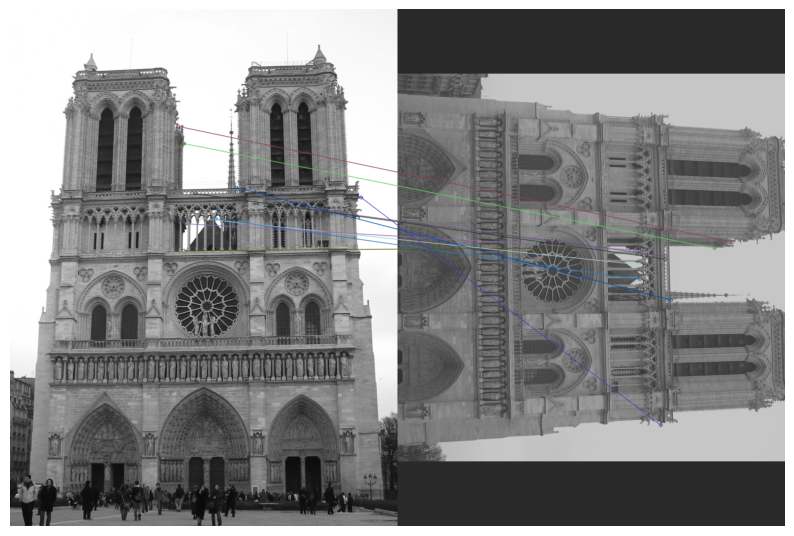
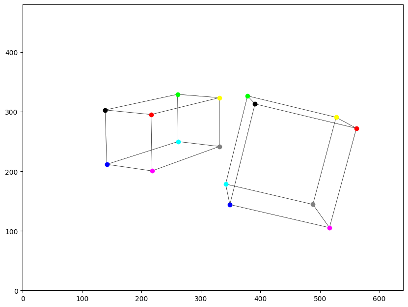
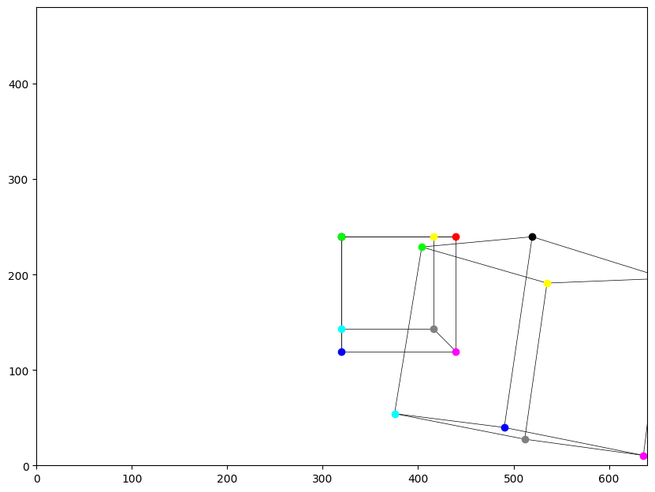
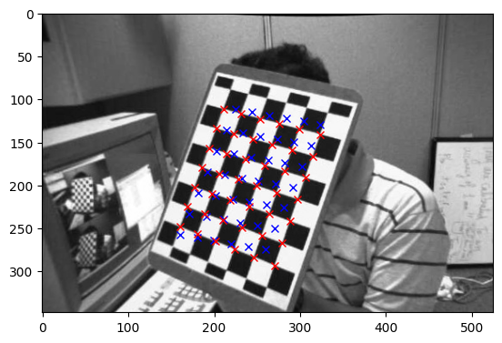
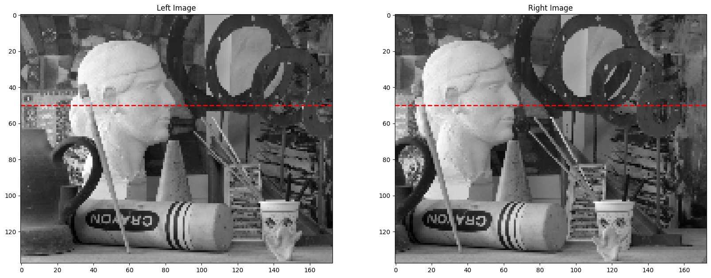
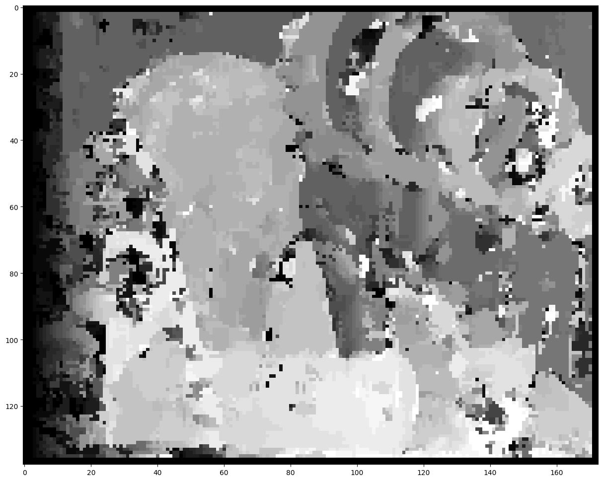
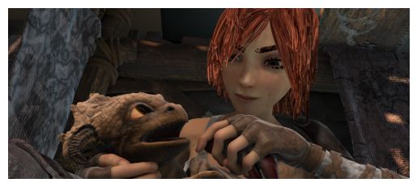

# 3D Computer Vision Assignments

This repository contains the code and resources for the assignments completed as part of the 3D Computer Vision course at Saarland University. Each assignment focuses on a specific topic in 3D computer vision, ranging from feature extraction to camera calibration and 3D reconstruction.

## Assignments Overview

1. **Assignment 1 - Feature Extraction and Matching**  
   Focuses on extracting features from images and matching them across multiple views.
   <p align="center"></p>

   2. **Assignment 2 - Transforms, Homogeneous Notation, and Projection**  
      Explores geometric transformations, homogeneous coordinates, and projection techniques.
      <p align="center">
         
         
      </p>

   3. **Assignment 3 - Camera Calibration**  
      Covers intrinsic and extrinsic camera calibration using multiple views.
      <p align="center"></p>

   4. **Assignment 4 - Semi-Global Matching (SGM)**  
      Implements the SGM algorithm for calculating the depth of each element in the image based on two images taken from different points of view.
      <p align="center"></p>  
      <p align="center"></p>

   5. **Assignment 5 - FlowNet**  
      Focuses on optical flow estimation using deep learning techniques. This involves training a model to estimate the motion of elements between two images captured at different time points.
      <p align="center"></p>  
      <p align="center"></p>

   6. **Assignment 6 - COLMAP**  
      Utilizes COLMAP for 3D reconstruction from multi-view images.

## Installation

To execute the code for any assignment, first move inside its folder and install the required dependencies file:

```bash
pip install -r requirements.txt
```

## Usage

Each assignment folder contains a Jupyter notebook where the results of the implemented code can be visualized. Navigate to the respective assignment folder and open the notebook to explore the results.
